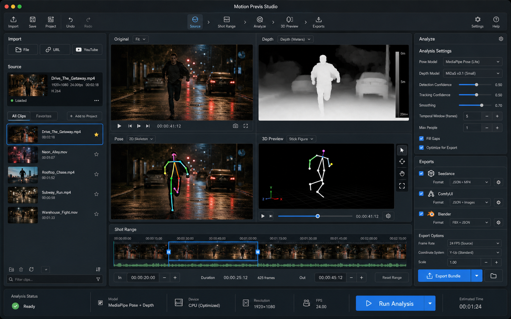
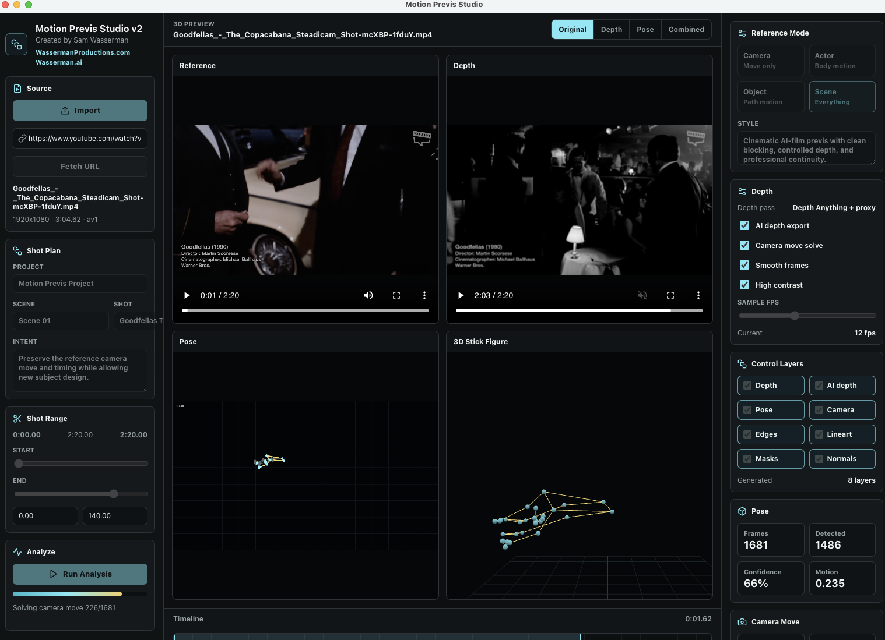

<p align="center">
  
</p>

# Motion Previs Studio v4

Developed and created by **Sam Wasserman**.

- [WassermanProductions.com](https://wassermanproductions.com)
- [Wasserman.ai](https://wasserman.ai)

Open-source under the [Apache License 2.0](LICENSE). Please preserve the [NOTICE](NOTICE) file and cite Sam Wasserman when using or building on this work.

Motion Previs Studio v4 is a cross-platform desktop app for turning source video shots into AI-film previsualization and control-reference bundles. It is built for filmmakers who want more precision before generating AI video: select a reference shot, extract pose, depth, camera movement, masks, edges, and control layers, then export a production pack for Seedance, ComfyUI, Blender, Runway, Kling, and similar workflows.

This repository contains the v4 source code. Local signed app bundles and generated build artifacts are intentionally not committed.

## New in v4

- **OpenPose / BODY_25 export.** Every bundle now ships a deterministic `openpose_pose.mp4` skeleton video plus per-frame `openpose_keypoints.json` in the standard OpenPose BODY_25 layout (75 numbers per person), for AI-video pipelines and ControlNet graphs that expect OpenPose input.
- **Subject-masked optical-flow camera solve.** The camera move is solved with Lucas-Kanade optical flow and a RANSAC similarity fit, masking out the tracked subject so the reference camera pan/tilt/zoom/roll is recovered from the background rather than the actor.
- **Deterministic frame encoding.** Control videos are encoded frame-by-frame through ffmpeg (no `captureStream`, no wall-clock timers), so exports are reproducible.
- **Security hardening.** Custom `mps://` protocol with `webSecurity` on, an IPC allowlist, and a path allowlist for all file access.
- **Send to Blockout.** After export, hand a Reference or Depth clip straight to a running [Blockout](https://github.com/wassermanproductions/blockout) session as a ghost underlay — one click, no files to shuffle.
- **Real per-stage progress and cancel.** A live Prepare → Pose → Camera → Encode → Bundle rail with a working Cancel that aborts cleanly between frames.
- **Project save / restore.** Sessions (media path, trim, settings, mode, last bundle) are written to the workspace and offered back for restore on relaunch; settings persist.
- **720p export option.** Scale control layers so the short edge is 720 for Seedance-style targets, or keep the source long-edge scaling.
- **One Reference Mode control.** A single segmented control — Camera only · Actor motion · Object motion · Full scene — with one-line explainers, replacing the old overlapping selectors.
- **Branding + quick-start help.** App logo on the welcome and header, an in-app credit footer, and a skimmable `?` quick-start overlay.
- **Agent control (MCP).** A localhost-only, token-gated control server + zero-dependency MCP bridge lets Claude Code, Codex, or Hermes drive a running app — import a shot, set the range/mode/settings, run analysis, export the pack, and hand a clip to Blockout. See [`mcp/README.md`](mcp/README.md).

## Screenshots

### Shot Bible and Production Pack


### Source Analysis Workspace



### Live Reference Analysis



## What It Does

- Imports local video files with Electron file access.
- Imports YouTube-compatible and direct web video URLs through `yt-dlp`.
- Lets you select a precise shot range before processing.
- Uses `ffmpeg` to normalize the selected clip and create fast local control passes.
- Uses MediaPipe Pose Landmarker locally in the renderer to extract 2D and world-space pose landmarks.
- Adds adjustable pose settings for model choice, detection confidence, tracking confidence, smoothing, temporal gap filling, sample FPS, and max people.
- Solves subject-independent camera move keyframes from global frame motion, so you can reuse the camera move without reusing the original actor, car, object, or environment.
- Adds Shot Plan, Reference Mode, Control Layers, Export Presets, and Quality readiness controls for AI-film preproduction.
- Shows working previews for reference video, camera path, colored 2D skeleton overlays, 3D stick-figure previs, depth, edges, masks, and pose diagnostics.
- Exports a bundle folder and ZIP designed for downstream AI-video and Blender workflows.

## Workflow

1. Import a local clip or paste a compatible video URL.
2. Choose the shot range you want to analyze.
3. Pick the reference mode:
   - `Camera only`: keep just the camera move and timing; replace the subject and world.
   - `Actor motion`: preserve body/pose motion plus the camera move.
   - `Object motion`: preserve an object or vehicle path plus the camera move.
   - `Full scene`: preserve camera, blocking, subject motion, and depth rhythm.
4. Select the control layers you want included.
5. Run analysis (cancel any time; each stage reports real progress).
6. Review pose, depth, camera, diagnostics, and quality metrics.
7. Export the Production Pack, then optionally Send to Blockout as a ghost reference.

## Exported Production Pack

Each export can include:

- `reference.mp4`
- `depth.mp4`
- `ai_depth.mp4` when the local AI depth pass is available
- `edges.mp4`
- `lineart.mp4`
- `motion_mask.mp4`
- `normals_proxy.mp4`
- `animatic.mp4`
- `contact_sheet.jpg`
- `pose_high_contrast.webm`
- `pose_high_contrast.mp4`
- `openpose_pose.mp4` — OpenPose BODY_25 skeleton video
- `openpose_keypoints.json` — per-frame OpenPose BODY_25 keypoints
- `combined_reference_depth_pose.mp4`
- `pose_landmarks.json`
- pose analysis settings and diagnostics in `pose_landmarks.json`, `model_presets.json`, and `bundle_manifest.json`
- `camera_motion.json`
- `blender_import_pose.py`
- `blender_import_camera.py`
- `blender_import_scene.py`
- `comfyui_manifest.json`
- `seedance_prompt.md`
- `prompt_pack.md`
- `shot_bible.json`
- `quality_report.json`
- `model_presets.json`
- `control_layers_manifest.json`
- `bundle_manifest.json`

## Camera-Only Mode

Camera-only mode is designed for cases where you like the movement of the reference shot but do not want to keep the same subject, vehicle, object, or environment. The app exports `camera_motion.json` and camera-specific prompt guidance so downstream tools can preserve pan, tilt, zoom, roll, timing, and shot rhythm while replacing the source content.

## Agent Control (MCP)

A running app can be driven by an AI agent (Claude Code, Codex, Hermes, or any MCP client) exactly like its sibling [Blockout](https://github.com/wassermanproductions/blockout). The main process runs a localhost-only, token-gated HTTP control server that advertises protocol v1 via `~/.config/motion-previs/control.json` on macOS/Linux or `%APPDATA%\Motion Previs Studio\v4\control.json` on Windows. A zero-dependency stdio MCP bridge (`mcp/motion-previs-mcp.mjs`) forwards tool calls to it.

The agent gets 11 tools: `get_state`, `import_file`, `import_url`, `set_range`, `set_mode`, `set_settings`, `run_analysis`, `export_pack`, `list_bundle`, `send_to_blockout`, and `screenshot`. The workflow is import → set range/mode → `run_analysis` → poll `get_state` until done → `export_pack` → `send_to_blockout`.

Connect it in one line:

```bash
claude mcp add motion-previs -- node "/ABSOLUTE/PATH/motion-previs-studio/mcp/motion-previs-mcp.mjs"
```

Full setup (Claude Code, Codex, Hermes, generic clients), the tool table, and a worked session are in [`mcp/README.md`](mcp/README.md). The app must be running for the tools to respond; the server binds `127.0.0.1` only and every request carries a bearer token, so nothing is exposed off-machine.

## Tech Stack

- Electron desktop app
- React + TypeScript renderer
- Vite build pipeline
- Three.js 3D preview
- MediaPipe Pose Landmarker
- FFmpeg / FFprobe
- yt-dlp for compatible web-video imports
- Playwright for desktop smoke and screenshot automation

## Development

```bash
npm install
npm run dev
```

`npm install` runs `scripts/prepare-mediapipe-assets.cjs`, which populates generated runtime assets under `public/mediapipe`, `public/models`, and `runtime/bin`. Every downloaded executable/model is pinned and SHA-256 verified against `ASSET_MANIFEST.json`. These generated assets are ignored by git and can be recreated with:

```bash
npm run prepare-assets
```

## Build

```bash
npm run build
npm run dist:dir
```

Use `npm run package:mac` for DMG/ZIP artifacts or `npm run package:win` on a
Windows 11 x64 host for the unsigned, assisted per-user NSIS installer. Windows
packages must be built after a fresh `npm ci` on Windows; do not reuse a macOS
`node_modules` tree.

The Windows installer does not require administrator rights, allows the install
folder to be selected, and creates Start Menu and desktop shortcuts. Because the
initial builds are unsigned, Windows SmartScreen may show an “unrecognized app”
warning. Verify the published SHA-256 before choosing **More info → Run anyway**.

Downstream packagers can set `MOTION_PREVIS_BUILDER_CONFIG` to an Electron
Builder configuration before `npm run build`; its `extraMetadata.distribution`
value is copied into the installed MCP bridge metadata so desktop and MCP
discovery use the same app identity and config directory.

MediaPipe and yt-dlp downloads are pinned and integrity checked. Windows uses
a pinned, audited BtbN GPL-3.0-or-later FFmpeg/FFprobe pair. macOS packages
build and audit a native GPL pair from a pinned, patched source recipe. Linux
development uses explicit runtime overrides or PATH and remains package-gated
until an audited native asset recipe is supplied. See `THIRD_PARTY_NOTICES.md`
and the release compliance bundle for source/provenance information.

## QA

```bash
npm run verify           # smoke checks
npm run verify:quality   # unified quality-score sync check
npm run verify:engines   # engine/runtime checks
npm run verify:platform  # path, protocol, manifest portability checks
npm run verify:metadata  # dependency/version/package contract checks
npm run verify:e2e       # headless Electron export (asserts OpenPose mp4 + keypoints in the bundle)
npm run verify:all       # verify + build + verify:e2e
npm run screenshots
```

The screenshot command writes GitHub-ready images to `docs/screenshots/`.

## Sharing Notes

The current local macOS build can run on this machine and can be shared with trusted testers, but it is not yet Apple Developer ID signed or notarized. For broad public sharing, the next packaging step is to add a real Apple Developer certificate, sign the app, notarize it with Apple, and then build the distributable DMG/ZIP.

## Open Source and Attribution

This project uses Apache-2.0 because it is permissive, standard, and includes a patent grant plus NOTICE preservation. Forks and derivative works must preserve copyright, license, and applicable attribution notices when redistributed.

The application source remains Apache-2.0. Packaged FFmpeg/FFprobe are separate
GPL-3.0-or-later components with their own source/compliance bundle. Stable or
commercial distribution remains gated on upstream/trademark permission, code
signing, an FFmpeg/H.264 licensing review, and the ordinary third-party
compliance review.

Standard open-source licenses cannot force every fork to display a prominent in-app credit badge or marketing credit. If you need that kind of mandatory public-facing credit, use a custom source-available license instead of a standard open-source license. For this open-source release, the repo includes:

- `LICENSE`: Apache License 2.0.
- `NOTICE`: Sam Wasserman / Wasserman Productions / Wasserman.ai attribution notice.
- `CITATION.cff`: GitHub-compatible citation metadata.
- `MODIFICATIONS.md`: summary of portability changes from the upstream baseline.
- `THIRD_PARTY_NOTICES.md`: packaged executable/model provenance and licenses.

## Future Ideas

- Add a true shot-board view for multiple clips in one project.
- Add batch processing for entire reference folders.
- Add ControlNet preset templates for common ComfyUI graphs.
- Add a direct Blender export that creates a `.blend` file automatically.
- Add team/project metadata and production notes per shot.
- Add signed and notarized release builds for easier public distribution.

## Attribution

Motion Previs Studio v4 was developed and created by **Sam Wasserman** for **Wasserman Productions** and **Wasserman.ai**.

- [WassermanProductions.com](https://wassermanproductions.com)
- [Wasserman.ai](https://wasserman.ai)
