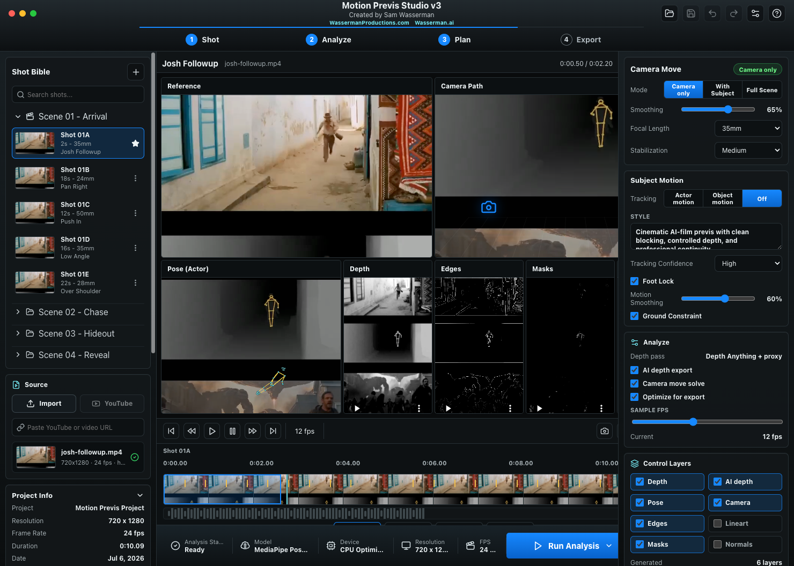
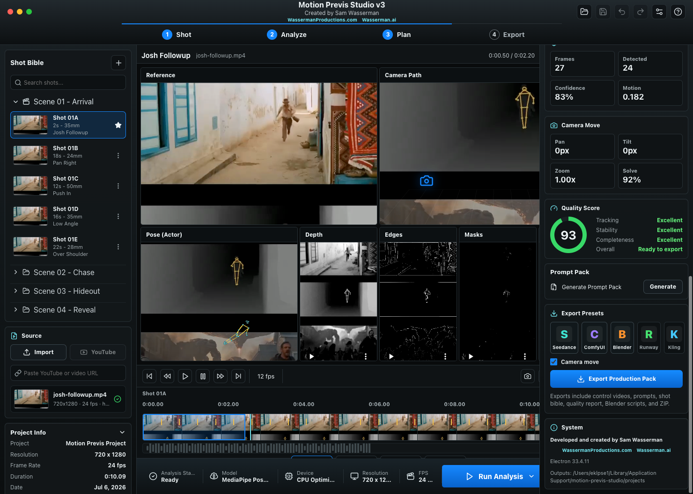

# Motion Previs Studio v3

Developed and created by **Sam Wasserman**.

- [WassermanProductions.com](https://wassermanproductions.com)
- [Wasserman.ai](https://wasserman.ai)

Open-source under the [Apache License 2.0](LICENSE). Please preserve the [NOTICE](NOTICE) file and cite Sam Wasserman when using or building on this work.

Motion Previs Studio v3 is a standalone desktop app for turning source video shots into AI-film previsualization and control-reference bundles. It is built for filmmakers who want more precision before generating AI video: select a reference shot, extract pose, depth, camera movement, masks, edges, and control layers, then export a production pack for Seedance, ComfyUI, Blender, Runway, Kling, and similar workflows.

This repository contains the v3 source code. Local signed app bundles and generated build artifacts are intentionally not committed.

## Screenshots

### Shot Bible and Production Pack


### Source Analysis Workspace



### Live Reference Analysis



## What It Does

- Imports local video files with Electron file access.
- Imports YouTube-compatible and direct web video URLs through `yt-dlp`.
- Lets you select a precise shot range before processing.
- Uses `ffmpeg` to normalize the selected clip and create fast local control passes.
- Uses MediaPipe Pose Landmarker locally in the renderer to extract 2D and world-space pose landmarks.
- Solves subject-independent camera move keyframes from global frame motion, so you can reuse the camera move without reusing the original actor, car, object, or environment.
- Adds Shot Plan, Reference Mode, Control Layers, Export Presets, and Quality readiness controls for AI-film preproduction.
- Shows working previews for reference video, camera path, actor pose, depth, edges, masks, and multi-pose/3D previs.
- Exports a bundle folder and ZIP designed for downstream AI-video and Blender workflows.

## Workflow

1. Import a local clip or paste a compatible video URL.
2. Choose the shot range you want to analyze.
3. Pick the reference mode:
   - `Camera`: preserve only the camera move and timing.
   - `Actor`: preserve actor body motion and camera movement.
   - `Object`: preserve object or vehicle path plus camera movement.
   - `Scene`: preserve the full reference shot structure.
4. Select the control layers you want included.
5. Run analysis.
6. Review pose, depth, camera, and quality metrics.
7. Export the Production Pack.

## Exported Production Pack

Each export can include:

- `reference.mp4`
- `depth.mp4`
- `ai_depth.mp4` when the local AI depth pass is available
- `edges.mp4`
- `lineart.mp4`
- `motion_mask.mp4`
- `normals_proxy.mp4`
- `animatic.mp4`
- `contact_sheet.jpg`
- `pose_high_contrast.webm`
- `pose_high_contrast.mp4`
- `combined_reference_depth_pose.mp4`
- `pose_landmarks.json`
- `camera_motion.json`
- `blender_import_pose.py`
- `blender_import_camera.py`
- `blender_import_scene.py`
- `comfyui_manifest.json`
- `seedance_prompt.md`
- `prompt_pack.md`
- `shot_bible.json`
- `quality_report.json`
- `model_presets.json`
- `control_layers_manifest.json`
- `bundle_manifest.json`

## Camera-Only Mode

Camera-only mode is designed for cases where you like the movement of the reference shot but do not want to keep the same subject, vehicle, object, or environment. The app exports `camera_motion.json` and camera-specific prompt guidance so downstream tools can preserve pan, tilt, zoom, roll, timing, and shot rhythm while replacing the source content.

## Tech Stack

- Electron desktop app
- React + TypeScript renderer
- Vite build pipeline
- Three.js 3D preview
- MediaPipe Pose Landmarker
- FFmpeg / FFprobe
- yt-dlp for compatible web-video imports
- Playwright for desktop smoke and screenshot automation

## Development

```bash
npm install
npm run dev
```

`npm install` runs `scripts/prepare-mediapipe-assets.cjs`, which populates generated runtime assets under `public/mediapipe`, `public/models`, and `public/bin`. These generated assets are ignored by git and can be recreated with:

```bash
npm run prepare-assets
```

## Build

```bash
npm run build
npm run dist:dir
```

The unpacked v3 desktop app is written to `release/mac-*` on macOS. Use `npm run dist` to create DMG/ZIP installers.

## QA

```bash
npm run verify
npm run verify:e2e
npm run verify:all
npm run screenshots
```

The screenshot command writes GitHub-ready images to `docs/screenshots/`.

## Sharing Notes

The current local macOS build can run on this machine and can be shared with trusted testers, but it is not yet Apple Developer ID signed or notarized. For broad public sharing, the next packaging step is to add a real Apple Developer certificate, sign the app, notarize it with Apple, and then build the distributable DMG/ZIP.

## Open Source and Attribution

This project uses Apache-2.0 because it is permissive, standard, and includes a patent grant plus NOTICE preservation. Forks and derivative works must preserve copyright, license, and applicable attribution notices when redistributed.

Standard open-source licenses cannot force every fork to display a prominent in-app credit badge or marketing credit. If you need that kind of mandatory public-facing credit, use a custom source-available license instead of a standard open-source license. For this open-source release, the repo includes:

- `LICENSE`: Apache License 2.0.
- `NOTICE`: Sam Wasserman / Wasserman Productions / Wasserman.ai attribution notice.
- `CITATION.cff`: GitHub-compatible citation metadata.

## Future Ideas

- Add a true shot-board view for multiple clips in one project.
- Add batch processing for entire reference folders.
- Add a stronger camera solve with optical flow and feature matching.
- Add ControlNet preset templates for common ComfyUI graphs.
- Add a direct Blender export that creates a `.blend` file automatically.
- Add team/project metadata and production notes per shot.
- Add signed and notarized release builds for easier public distribution.

## Attribution

Motion Previs Studio v3 was developed and created by **Sam Wasserman** for **Wasserman Productions** and **Wasserman.ai**.

- [WassermanProductions.com](https://wassermanproductions.com)
- [Wasserman.ai](https://wasserman.ai)
