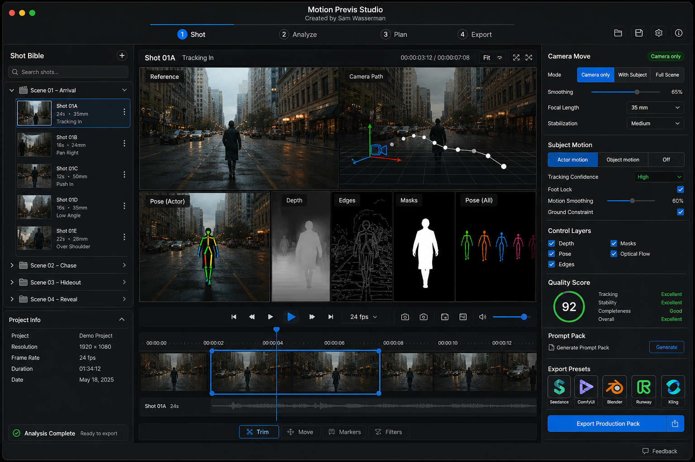

# Motion Previs Studio Operator Handbook

**Windows and macOS standard operating procedures**

**Project:** Motion Previs Studio

**Original application:** Sam Wasserman / Wasserman Productions

**Document status:** Maintainer review draft
**Edition:** Revision 05 - 2026-07-14

## Purpose

Motion Previs Studio turns an existing video shot into measurable production references: pose, depth, camera motion, edges, masks, normals, optical flow, OpenPose data, prompts, and portable export packages. It helps a filmmaker understand and transfer movement; it does not invent a performance or create finished character animation by itself.

This handbook provides a repeatable human workflow, an agent-assisted workflow, and clear acceptance gates for local files, compatible web sources, Production Packs, and the supported reference handoff to Blockout.

## What the Windows work accomplished

The cross-platform implementation extended the application to Windows 11 while preserving the existing macOS workflow:

- Native Windows packaging and a Windows-safe development command.
- Current Electron and packaging tools shared with the companion applications.
- Native, pinned FFmpeg, FFprobe, MediaPipe, and downloader assets with integrity checks.
- Explicit FFmpeg routing for compatible web-source imports.
- Portable Production Pack manifests that keep absolute paths out of distributable bundles.
- Windows-safe handling for drive and network-share paths, including canonical path comparison and junction containment.
- Cooperative cancellation that waits for encoders to close before temporary files are cleaned.
- A health-checked, versioned reference handoff to a running Blockout instance.
- Packaged MCP bridge and synchronized product/version metadata.

### How it was achieved

The application remained one Electron, React, and TypeScript codebase. Runtime assets are built and verified natively on each operating system. Imported files pass through an allowlisted application protocol rather than raw browser file URLs. Existing paths are canonicalized before comparison, portable outputs contain only relative names, and live absolute paths remain confined to the running application. Long analysis stages share one cooperative cancellation contract.

## Capability map

| Stage | What Motion Previs contributes | Review question |
|---|---|---|
| Shot | Source, range, scene and shot identity, intent, and reference mode | Is this the exact continuous performance range? |
| Analyze | Pose, depth, camera, edges, masks, normals, optical flow, and OpenPose | Do the control layers follow the action consistently? |
| Plan | Camera and subject-motion interpretation, shot notes, and prompt context | Does the interpretation match production intent? |
| Export | Control media, keypoints, reports, scripts, prompts, and ZIP package | Is the bundle portable and complete? |

> **Operating boundary:** analysis quality supports review; a score alone is not approval. Inspect the beginning, action apex, and end of every required layer.

## Before every session

1. Launch the intended build and confirm the application version.
2. Choose a short, continuous source shot without an internal edit.
3. Confirm that the source is authorized for the production.
4. Record the intended project, scene, shot, range, and reference mode.
5. Confirm enough storage for generated control media and the final ZIP.
6. Start Blockout first only when a handoff will be performed during the session.
7. For repeat work, create a new export version rather than overwriting an approved Production Pack.

## Reference-mode decision

| Mode | Use when | Review emphasis |
|---|---|---|
| Actor motion | One performer carries the important action | Pose continuity, body timing, foot contact, and subject mask |
| Camera only | The source camera move is the primary reference | Background flow, solve stability, and path plausibility |
| Full scene | Subject motion and camera movement both matter | Separation of subject motion from global camera motion |

## Human SOP

### 1. Import a local source and define the shot

1. Choose **Open File** and select the intended source.
2. Confirm the preview shows that source rather than a restored earlier session.
3. Enter project, scene, shot, and intent information.
4. Set the start and end of one continuous range.
5. Choose Actor motion, Camera only, or Full scene.
6. Review the first and final selected frames before analysis.

**Accept when:** the visible source, range, identity, and mode match the production brief.

### 2. Import a compatible web source

1. Enter a controlled source URL supported by the current build.
2. Review the resolved title, duration, and source before accepting the import.
3. Wait for the local working copy to finish.
4. Play the beginning, midpoint, and end of the imported copy.
5. Apply the same range and mode checks used for a local source.

**Accept when:** the local working copy is complete, plays normally, and matches the intended source.

### 3. Configure analysis deliberately

1. Select only layers that support a real downstream decision.
2. Enable pose for performer timing and body continuity.
3. Enable depth when spatial separation or depth-guided generation is required.
4. Enable camera analysis when the source camera move matters.
5. Enable edges, masks, normals, optical flow, or OpenPose when a selected tool or artist needs them.
6. Confirm the compute profile and any model choice shown by the current build.
7. Run analysis and keep the application open until completion or a clean cancellation.

**Accept when:** the job reaches Done with no missing required layer and no unresolved encoder process.

### 4. Review the shot, not just the score

1. Inspect the reference at the start, action apex, and end.
2. Check pose landmarks for swaps, collapse, missed limbs, and discontinuity.
3. Check depth for subject/background separation and temporal stability.
4. Check camera solve for direction, scale, and stability.
5. Check edges and masks for flicker or missing subjects.
6. Check the 3D stick figure and OpenPose output for consistent timing.
7. Record any layer that is unsuitable for downstream use.

**Accept when:** every required layer is visually coherent for the selected range and the production team knows which layers are approved.

### 5. Export and validate a Production Pack

1. Open **Export** and confirm the active shot and approved layers.
2. Choose downstream presets intentionally.
3. Export the Production Pack and wait for **Bundle ready**.
4. Open the output folder and ZIP.
5. Confirm control media, keypoints, prompt text, reports, scripts, shot information, and manifest content.
6. Confirm manifest entries use portable relative filenames.
7. Confirm every referenced file exists inside the package.
8. Open representative media and inspect its duration, dimensions, and final frame.
9. Preserve the ZIP and manifest together as one versioned deliverable.

**Accept when:** the package can be moved to a different folder and remains internally complete.

> **External-generation boundary:** generator presets, prompts, control media, and reference layers are portable production inputs. Hosted generation through Higgsfield, Seedance, Kling, Wan, or another provider happens outside Motion Previs Studio and is governed by that provider's service and model terms.

### 6. Send an approved reference to Blockout

1. Launch Blockout and open the intended destination project.
2. Confirm Blockout reports a healthy live connection in Motion Previs Studio.
3. Select Reference or Depth according to the production decision.
4. Send the approved layer.
5. In Blockout, confirm the copied clip appears as a synchronized underlay.
6. Save and reopen the Blockout project to confirm the reference persists.

**Accept when:** the approved media exists in the destination project and remains synchronized after reopen.

> **Handoff boundary:** this is a reference-media transfer. It does not retarget a detected skeleton to a Blockout performer or create finished animation automatically.

### 7. Restore, relink, cancel, and rerun

1. If a restored session cannot find external media, use the relink flow and select the reviewed source.
2. If the wrong range or mode was analyzed, stop and create a new version rather than overwriting approved work.
3. To cancel, use the visible Cancel control and wait for the application to return to a stable state.
4. Confirm no encoder remains active and temporary output is no longer locked.
5. Rerun only after the source, range, mode, and layer selections have been rechecked.

## Agent-assisted SOP

### Agent preflight

1. Launch Motion Previs Studio.
2. Call `get_state` and verify there is a live application response.
3. Confirm the visible or reported active source is the intended source.
4. Keep machine-local control descriptors out of published logs and documentation.

### Supported agent sequence

1. `import_file` or `import_url`.
2. `set_range`.
3. `set_mode`.
4. `set_settings` for explicitly approved analysis choices.
5. `run_analysis` and poll until Done.
6. `screenshot` for local review only.
7. `export_pack` and `list_bundle`.
8. If Blockout is live and approved, `send_to_blockout`.
9. Return source identity, selected range, approved layers, bundle path, and unresolved human decisions.

### Mandatory human boundary

The MCP surface does not expose every visible planning, model, depth, layer, preset, or cancellation decision. A human operator must approve creative layer selection, inspect the actual control media, perform any visible cancellation not available to the agent, and approve the handoff destination.

## Production Pack acceptance checklist

- [ ] Source and selected range are correct.
- [ ] Reference mode matches the shot's purpose.
- [ ] Required pose, depth, camera, and control layers completed.
- [ ] Beginning, apex, and final moments were reviewed.
- [ ] Quality score is recorded but not used as the sole approval signal.
- [ ] ZIP opens and every manifest entry resolves.
- [ ] Distributable manifests contain portable relative filenames.
- [ ] Control media reaches its declared final frame.
- [ ] Cancellation leaves no encoder or locked temporary output.
- [ ] Blockout handoff is accepted only after live health and destination checks.

## Recovery guide

| Symptom | Recovery |
|---|---|
| Wrong source restored | Stop, import the reviewed source again, and verify first/mid/final frames. |
| Pose landmarks swap or collapse | Shorten the range, improve source visibility, or exclude the affected pose layer. |
| Camera path follows the subject | Recheck reference mode and subject masking; compare Camera only and Full scene deliberately. |
| Depth is unavailable or unstable | Retry the supported fallback, then record the layer as unavailable if it still fails. |
| Production Pack is incomplete | Preserve the failed version, rerun export, and compare the new manifest against the required-file list. |
| Source moved after restore | Use Relink; do not write an absolute source path into the portable bundle manifest. |
| Blockout appears unavailable | Launch Blockout, open the correct project, wait for live health, and retry once. |
| Cancel was requested | Wait for all analysis and encoding stages to close before deleting temporary files or starting another job. |

## Validation summary

Cross-platform validation covered local and controlled web imports, MediaPipe pose, camera solve, control-layer review, OpenPose artifacts, portable ZIP manifests, depth fallback, cancellation, MCP operations, and the packaged Motion-to-Blockout handoff across restart.

An earlier representative validation shot completed 96 of 96 frames with 98 percent pose confidence, a 99 percent camera solve, and a quality score of 100. Its Production Pack contained 28 expected files and passed path, size, and checksum comparison.

The current two-film walkthrough added physical Windows proof for *Signal Run* and *The Twelfth Shadow*: each 90-second final film was imported, reduced to a deliberate shot-sized analysis range, analyzed in the visible application, exported as a portable Production Pack, and sent as approved reference media to a live Blockout destination. Both handoffs survived destination save and reopen. These aggregate results are included without publishing source-media details, machine identities, local paths, or raw desktop captures.

## Publication and maintenance

- Use fictional source names and portable paths in examples.
- Do not publish machine-local control descriptors or private source media.
- Keep the handoff described as reference media, not skeleton retargeting.
- Keep this Markdown file as the reviewable source for the PDF edition.
- Update the handbook whenever a visible label, layer, export component, or MCP capability changes.

### Attribution and license

Motion Previs Studio was created by **Sam Wasserman / Wasserman Productions** and its application source is distributed under the repository's [Apache-2.0 license](../../LICENSE). Preserve its NOTICE, citation, copyright, and in-application credit. Windows distributions that bundle FFmpeg carry that component's separate GPL license, provenance, and corresponding-source obligations. The name, logo, and concept artwork used here come from this upstream repository; final mark usage remains subject to maintainer approval.
